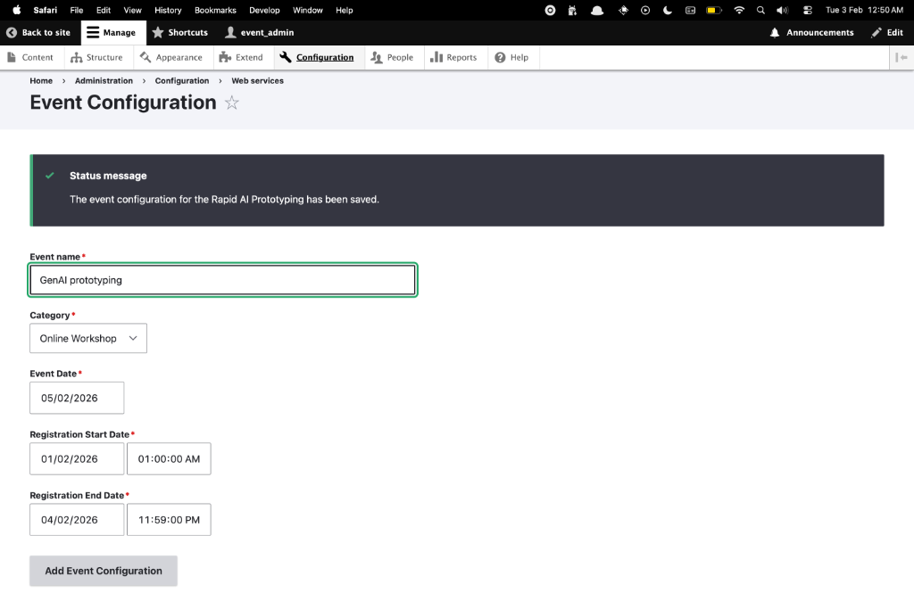
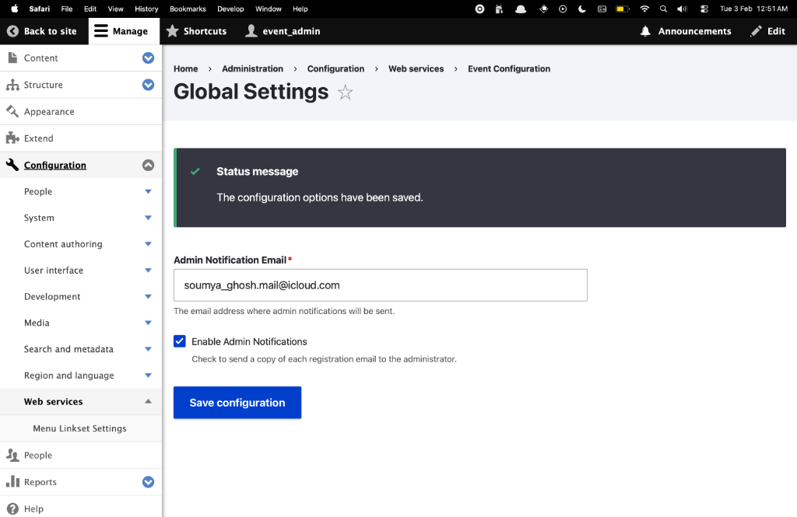
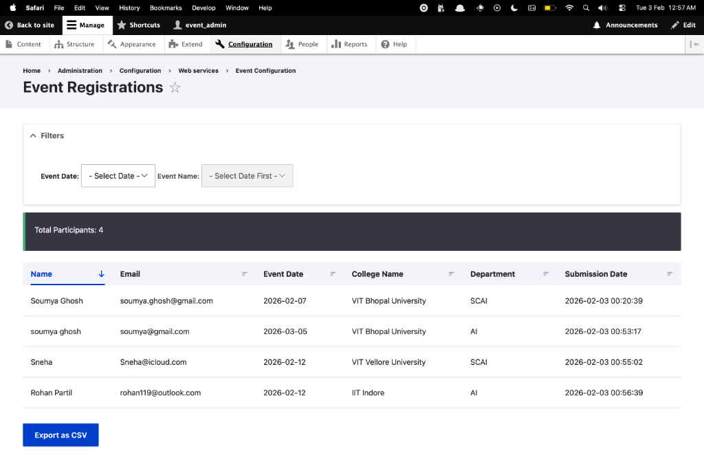
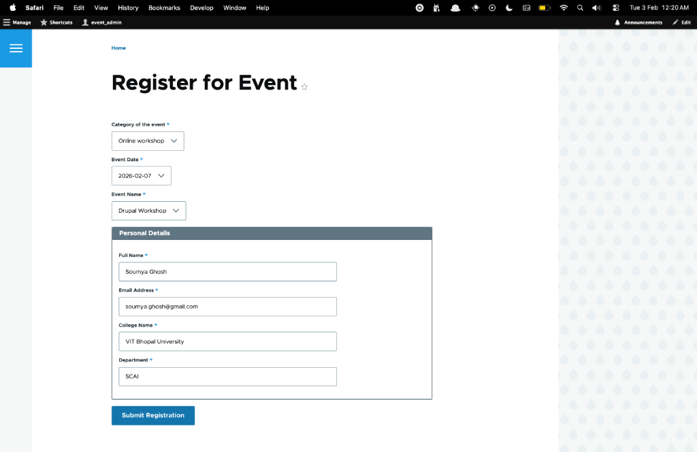
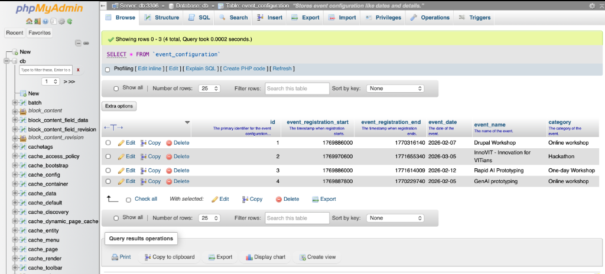
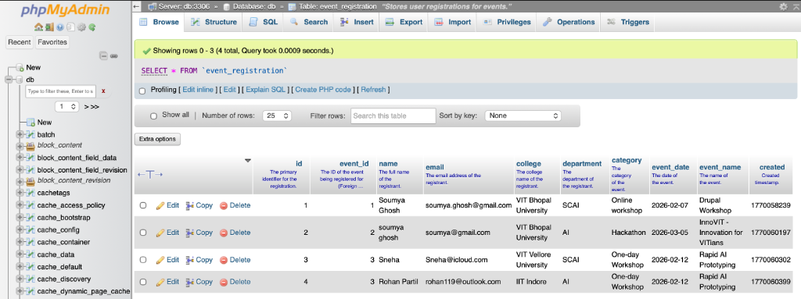
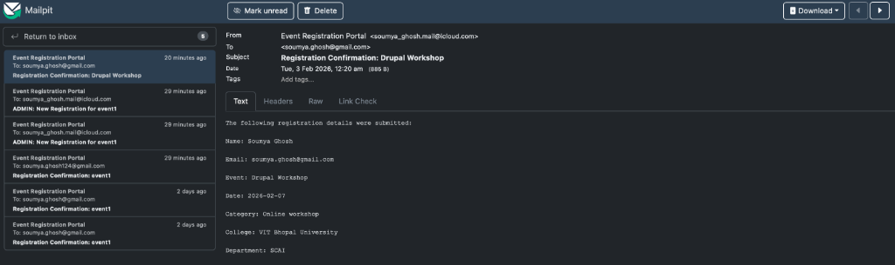

# Event Registration Drupal 10 Module

[](https://www.drupal.org/)
[](https://www.php.net/)
[](https://www.gnu.org/licenses/old-licenses/gpl-2.0.en.html)

A professional, high-performance Drupal 10 module designed for seamless event management and registrant tracking. This module emphasizes a reactive UX, strict data integrity, and enterprise-grade code architecture.

---

## 📌 Table of Contents
1. [Key Features](#-key-features)
2. [Installation & Setup](#-installation--setup)
3. [Administrative Dashboard](#-administrative-dashboard)
4. [Public Experience](#-public-experience)
5. [Developer Documentation](#-developer-documentation)
    - [Architecture](#architecture)
    - [Database Access](#database-access)
    - [Email Testing](#email-testing)
6. [Standards](#-standards)

---

## ✨ Key Features

*   **Reactive AJAX Flows**: Deep cascading logic (**Category → Date → Event**) ensures a frictionless registration process.
*   **Time-Locked Windows**: Automatic locking of registration based on customizable start/end windows.
*   **Live Analytics**: Real-time participant counting and multi-criteria filtering in the admin portal.
*   **Security Focused**: 
    *   Strict duplicate prevention (one registration per person per event date).
    *   Robust input sanitization via regex to prevent XSS and SQL injection.
*   **Decoupled Architecture**: 100% Dependency Injection; zero static service calls.

---

## ⚙️ Installation & Setup

### Prerequisites
- PHP 8.3+
- Composer 2.x
- MySQL/MariaDB
- A local development environment (DDEV recommended)

### Step 1: Clone the Repository
```bash
git clone https://github.com/soumyaGhoshh/drupal-custom-event-register-module.git
cd drupal-custom-event-register-module
```

### Step 2: Install Dependencies
```bash
composer install
```

### Step 3: Setup Drupal (DDEV Method - Recommended)
```bash
# Configure DDEV for the project
ddev config --project-type=drupal11 --docroot=web

# Start DDEV environment
ddev start

# Install Drupal site
ddev drush site:install --db-url=mysql://db:db@db/db -y

# Enable the custom module
ddev drush en event_registration -y

# Launch the site
ddev launch
```

### Alternative: Manual Setup (Without DDEV)
```bash
# Configure database in web/sites/default/settings.php
# Create settings.php from default.settings.php and add database credentials

# Install Drupal via browser: http://your-local-domain/install.php
# After installation, enable the module:
vendor/bin/drush en event_registration -y
```

### Post-Installation
The module will automatically create two database tables:
- `event_configuration`: Stores event metadata and registration windows.
- `event_registration`: Stores registrant data with foreign key to `event_configuration`.

---

## 🛠️ Administrative Dashboard

### Configuration
Manage your events and global notification settings.

*   **Event Setup**: `/admin/config/services/event-registration`
    > [!TIP]
    > You can configure multiple events. Registration forms will only enable when the current time is within the defined window.
    

*   **Global Alerts**: `/admin/config/services/event-registration/global`
    

### Registrations & Export
Monitor attendees and export data for external use.
*   **Path**: `/admin/config/services/event-registration/registrations`
    

---

## 🌐 Public Experience

Users interact with a reactive form located at:  
👉 **`/event/register`**



---

## 💻 Developer Documentation

### Architecture
- **Form API**: Custom cascading AJAX callbacks for dynamic field updates.
- **Mail API**: Integrated `hook_mail` for transactional user and admin notifications.
    - *Logic*: Notifications are triggered upon successful database insertion. A personalized confirmation is sent to the registrant, and an optional alert is sent to the admin email configured in 'Global Settings'.
- **Database**: Custom schema implementation via `hook_schema`.
- **Validation Logic**: 
    - *Duplicates*: Checks existing records (Email + Date) to prevent multiple registrations.
    - *Sanitization*: Regex filters (`/[^a-zA-Z0-9\s.\-,]/`) ensure no malicious characters in text fields.
    - *Integrity*: Server-side validation ensures a valid `event_id` is present before processing.

### Database Access
To inspect the underlying relational data in your local environment:
```bash
# Launch phpMyAdmin
ddev phpmyadmin
```
**Relational View:**



#### Table: `event_configuration`
*   `id`: Primary key.
*   `event_registration_start/end`: Unix timestamps for the registration window.
*   `event_date`: Stored string for localized display.
*   `event_name / category`: Textual metadata.

#### Table: `event_registration`
*   `event_id`: Foreign key linked to `event_configuration`.
*   `name / email / college / department`: Registrant personal data.
*   `created`: Timestamp of submission.

### Email Testing
We use **Mailpit** to capture all outgoing registrations.
```bash
# Browse Captured Mail
ddev mailpit
```
**Mailpit Inbox View:**


---

## 🏆 Standards
*   **PSR-4 Autoloading**
*   **Drupal 10.x/11.x Core Compatibility**
*   **PSR-12 PHP Coding Standards**
*   **Strict Dependency Injection Pattern**
